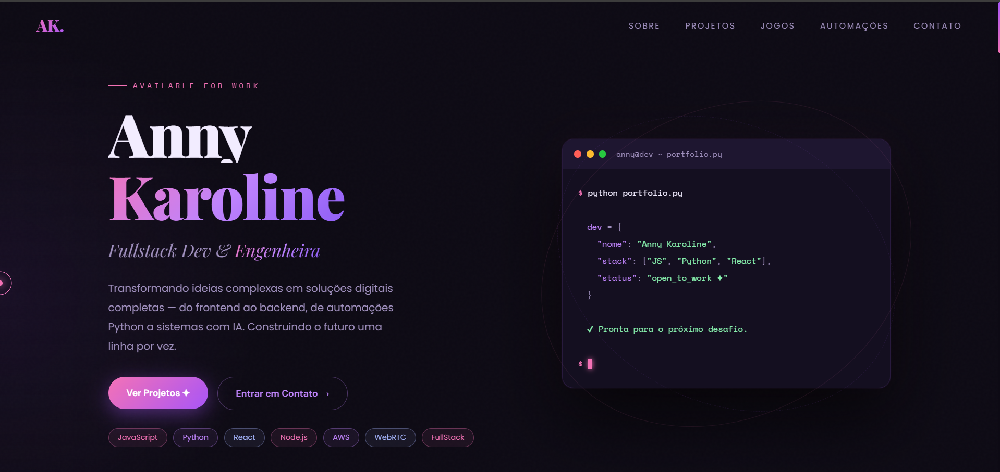

# Anny Karoline - Personal Portfolio

<p align="center">
  <a href="#-english-version">English</a> •
  <a href="#-versão-em-português">Português</a>
</p>

<p align="center">
  
</p>

---

## 🇬🇧 English Version

<p align="center">
  Welcome to the repository for my personal portfolio! This project was developed to showcase my skills, experiences, and projects as a Full Stack Developer. It's a showcase of my work, built with modern technologies and a focus on a fluid and enjoyable user experience.
</p>

<p align="center">
  <a href="https://your-portfolio-link.vercel.app/">
    <strong>✨ Access the live demo ✨</strong>
  </a>
</p>

### 🚀 Key Features

- **Responsive Design:** Fully adapted for perfect viewing on desktops, tablets, and smartphones.
- **Modern Animations:** Subtle and elegant animations with `Framer Motion` for a more dynamic user experience.
- **Interactive Timeline:** A visual journey that switches between my professional and academic experiences.
- **Multi-language Support:** Content can be viewed in Portuguese (PT) and English (EN).
- **Functional Contact Form:** Integrated with **Formspree** to receive messages directly in my email.
- **Sophisticated Dark Theme:** A dark color palette with gold accents for a striking visual identity.

### 🛠️ Technologies Used

This project was built using the following technologies:

- **Front-end:**
  - **React:** Main library for building the interface.
  - **Vite:** Extremely fast build tool for development.
  - **Tailwind CSS:** CSS framework for rapid and responsive styling.
  - **Framer Motion:** For complex and fluid animations.
  - **React Icons:** For including icons.
  - **AOS (Animate On Scroll):** For entry animations on scroll.

### ⚙️ How to Run Locally

Follow the steps below to run the project on your machine.

**Prerequisites:**

- Node.js (version 18 or higher)
- npm or Yarn

**Steps:**

1. **Clone the repository:**

   ```bash
   git clone https://github.com/AnnyKaah/meu-portfolio.git
   ```

2. **Navigate to the project directory:**

   ```bash
   cd anny-portfolio
   ```

3. **Install dependencies:**

   ```bash
   npm install
   ```

4. **Start the development server:**

   ```bash
   npm run dev
   ```

5. **Open in browser:**
   Access `http://localhost:5173` (or the port indicated in your terminal) to see the project.

### 📬 Contact

Did you like what you saw? Let's connect!

- **LinkedIn:** Anny Karoline
- **Email:** annykamartins@icloud.com

---

## 🇧🇷 Versão em Português

<p align="center">
  Bem-vindo ao repositório do meu portfólio pessoal! Este projeto foi desenvolvido para apresentar minhas habilidades, experiências e projetos como Desenvolvedora Full Stack. É uma vitrine do meu trabalho, construída com tecnologias modernas e foco em uma experiência de usuário fluida e agradável.
</p>

<p align="center">
  <a href="https://seu-portfolio.vercel.app/">
    <strong>✨ Acessar a demonstração ao vivo ✨</strong>
  </a>
</p>

### 🚀 Funcionalidades Principais

- **Design Responsivo:** Totalmente adaptado para uma visualização perfeita em desktops, tablets e smartphones.
- **Animações Modernas:** Animações sutis e elegantes com `Framer Motion` para uma experiência de usuário mais dinâmica.
- **Linha do Tempo Interativa:** Uma jornada visual que alterna entre minhas experiências profissionais e acadêmicas.
- **Suporte a Múltiplos Idiomas:** O conteúdo pode ser visualizado em Português (PT) e Inglês (EN).
- **Formulário de Contato Funcional:** Integrado com o **Formspree** para receber mensagens diretamente no meu e-mail.
- **Tema Escuro Sofisticado:** Uma paleta de cores escura com detalhes em dourado para uma identidade visual marcante.

### 🛠️ Tecnologias Utilizadas

Este projeto foi construído utilizando as seguintes tecnologias:

- **Front-end:**
  - **React:** Biblioteca principal para a construção da interface.
  - **Vite:** Ferramenta de build extremamente rápida para o desenvolvimento.
  - **Tailwind CSS:** Framework CSS para estilização rápida e responsiva.
  - **Framer Motion:** Para animações complexas e fluidas.
  - **React Icons:** Para a inclusão de ícones.
  - **AOS (Animate On Scroll):** Para animações de entrada ao rolar a página.

### ⚙️ Como Rodar o Projeto Localmente

Siga os passos abaixo para executar o projeto na sua máquina.

**Pré-requisitos:**

- Node.js (versão 18 ou superior)
- npm ou Yarn

**Passos:**

1. **Clone o repositório:**

   ```bash
   git clone https://github.com/AnnyKaah/meu-portfolio.git
   ```

2. **Navegue até o diretório do projeto:**

   ```bash
   cd anny-portfolio
   ```

3. **Instale as dependências:**

   ```bash
   npm install
   ```

4. **Inicie o servidor de desenvolvimento:**

   ```bash
   npm run dev
   ```

5. **Abra no navegador:**
   Acesse `http://localhost:5173` (ou a porta indicada no seu terminal) para ver o projeto.

### 📬 Contato

Gostou do que viu? Vamos nos conectar!

- **LinkedIn:** Anny Karoline
- **E-mail:** annykamartins@icloud.com

---

_Feito com ❤️ por Anny Karoline._
