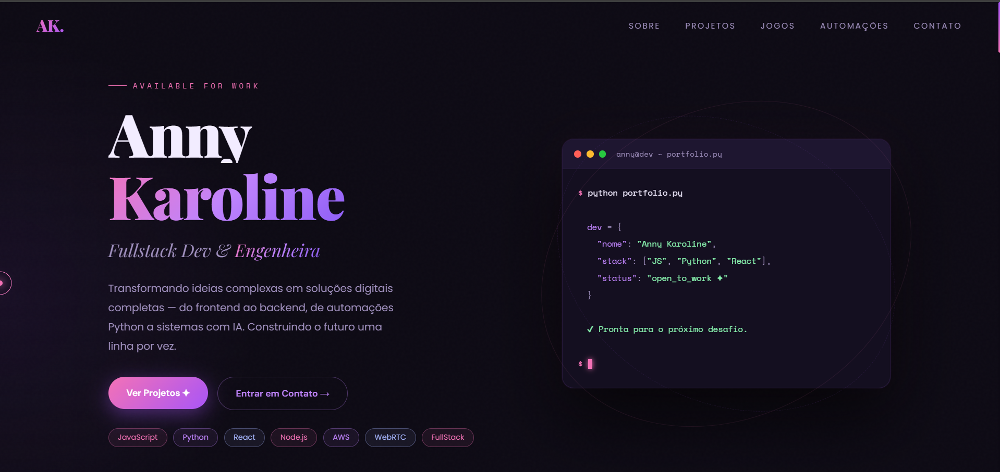

# 🚀 Anny Karoline | FullStack Developer & Engineer

<p align="center">
  
</p>

<div align="center">
  
  [](https://anny-dev.vercel.app/)
  [](https://www.linkedin.com/in/annykarolinedecarvalhomartins)
  [](mailto:annykamartins@icloud.com)

</div>

<br />

> *"Transformando a lógica da Engenharia em soluções digitais criativas."*

Bem-vindo ao repositório do meu portfólio pessoal! Este projeto não é apenas uma vitrine, mas uma experiência imersiva desenvolvida com **React, Framer Motion e WebGL**. Aqui, apresento minha transição de Engenheira de Materiais para Desenvolvedora Full Stack, combinando pensamento sistêmico com código de alta performance.

---

## 🌌 Sobre o Projeto

Este portfólio foi construído para ser **rápido, responsivo e visualmente impactante**. Ele utiliza um tema espacial "Cyberpunk/Neon" com partículas interativas e animações fluidas.

### ✨ Destaques Técnicos
- **🎨 UI/UX Imersiva:** Design System próprio com *Glassmorphism*, *Neon Glow* e tipografia moderna.
- **⚡ Performance:** Construído com Vite para carregamento instantâneo.
- **🎭 Animações:** Uso avançado de `Framer Motion` para transições de página, *scroll reveal* e micro-interações.
- **🎮 Gamificação:** Seção dedicada a jogos desenvolvidos com Canvas API e Web Audio.
- **📱 PWA Ready:** Responsividade total para Mobile, Tablet e Desktop.

---

## 🛠️ Tech Stack

<div align="center">

**Front-end & Design**
<br>
<a href="https://react.dev/" target="_blank"></a>
<a href="https://tailwindcss.com/" target="_blank"></a>
<a href="https://www.framer.com/motion/" target="_blank"></a>
<a href="https://vitejs.dev/" target="_blank"></a>

<br><br>
**Back-end & Data**
<br>
<a href="https://nodejs.org/" target="_blank"></a>
<a href="https://www.python.org/" target="_blank"></a>
<a href="https://aws.amazon.com/" target="_blank"></a>

<br><br>
**Tools & Automation**
<br>
<a href="https://git-scm.com/" target="_blank"></a>
<a href="https://n8n.io/" target="_blank"></a>
<a href="https://code.visualstudio.com/" target="_blank"></a>

</div>

---

## 🔮 Projetos em Destaque

| Projeto | Tech Stack | Descrição |
| :--- | :--- | :--- |
| **🤖 Lumen AI** | `Python` `LLM` `XAI` | Sistema de triagem inteligente de emails corporativos. Reduz tempo operacional em 60% usando IA Explicável. |
| **⚔️ Terras de Ferro** | `WebRTC` `PeerJS` `PWA` | RPG Dark Fantasy Cooperativo P2P em tempo real. UI cinematográfica e sistema Ironsworn. |
| **🦸 HabitHero** | `React` `TypeScript` `Node` | App FullStack gamificado para construção de hábitos e rotinas com sistema de recompensas. |
| **☁️ Cloud Girls AWS** | `AWS` `IaC` `Serverless` | Jornada completa de Cloud Computing: EC2, S3, Lambda, VPC e arquitetura serverless. |

> *Confira a seção "Jogos" no portfólio para ver experimentos com Canvas e Web Audio API!*

---

## 📊 GitHub Stats

<div align="center">
  <a href="https://github.com/AnnyKaah">
  
  
  </a>
</div>

---

## 🚀 Como Rodar Localmente

Quer ver a mágica acontecer na sua máquina? Siga os passos:

```bash
# 1. Clone o repositório
git clone https://github.com/AnnyKaah/meu-portfolio.git

# 2. Entre na pasta
cd meu-portfolio

# 3. Instale as dependências
npm install

# 4. Inicie o servidor de desenvolvimento
npm run dev
```

Acesse `http://localhost:5173` e aproveite a viagem! 🚀

---

## 📬 Vamos Conectar?

Estou sempre aberta a novos desafios, freelas e colaborações que envolvam **React, Python e IA**.

<a href="https://www.linkedin.com/in/annykarolinedecarvalhomartins">
  
  </a>
<a href="mailto:annykamartins@icloud.com">
  
</a>

<br />
<br />

<p align="center">
  <i>Feito com 💜 e muita cafeína por Anny Karoline.</i>
</p>
